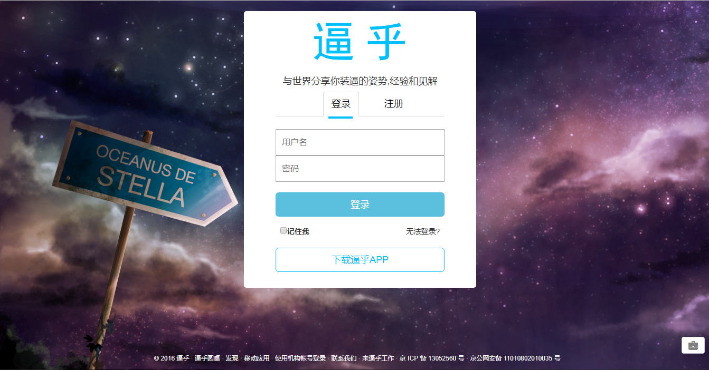
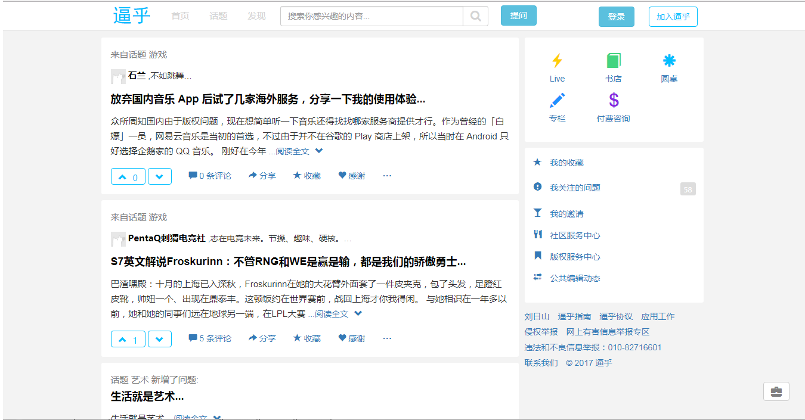
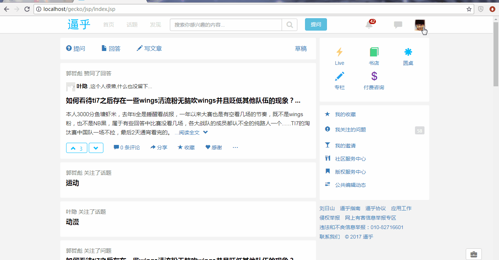
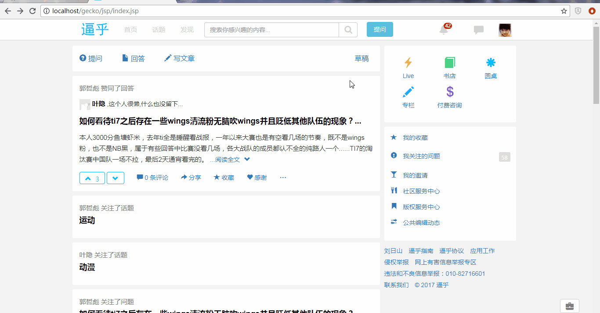
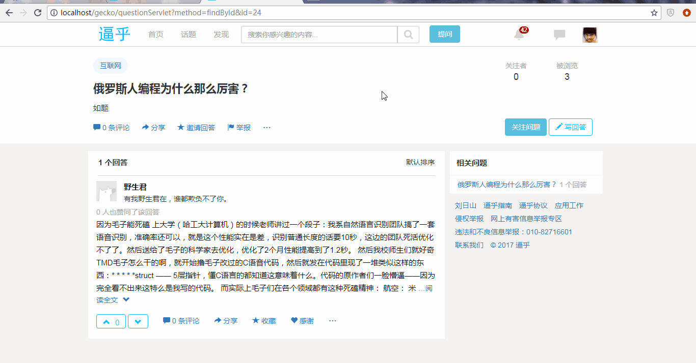
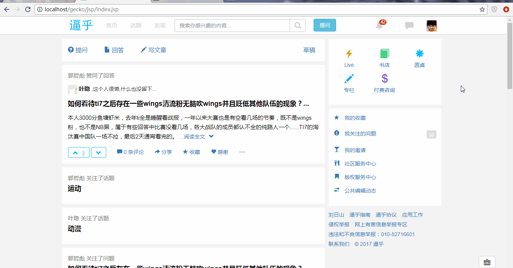
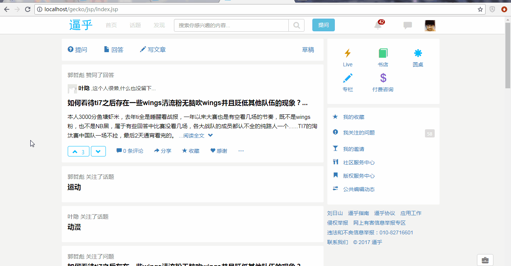
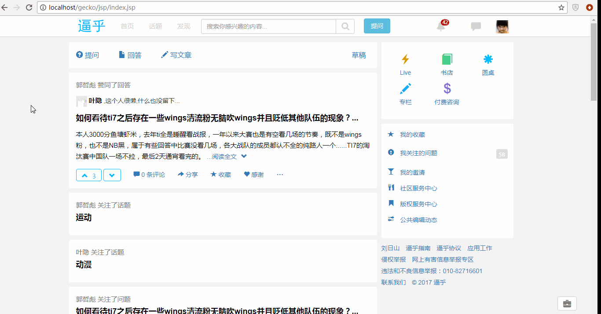

# Gecko 

## Introduction

Gecko is a faker of website named [**ZhiHu**](http://www.zhihu.com), just for fun and study.

Gecko是仿照[**知乎**](http://www.zhihu.com)写的一个社交平台, 初衷是为了好玩以及学习. 

## The technology used

* jQuery 1.11.3
* Bootstrap 3.3.5
* UEditor 1.4.3
* jquery.validate 1.9.0
* html2canvas-0.5.0-beta4
* font-awesome-4.7.0
* jsp / servlet

## Screenshots

* **Index**
  

  ​

* **Person homepage**  
  

  ​

* **Search**
  

  ​

* **Answer**

  

  ​

* **Question**

  

  ​

* **Article**

  

* **Topic**

## Contact Me
* huleski@gmail.com

